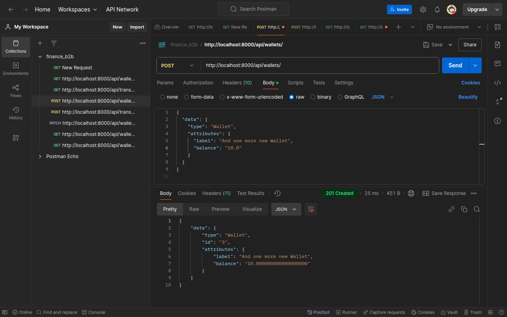
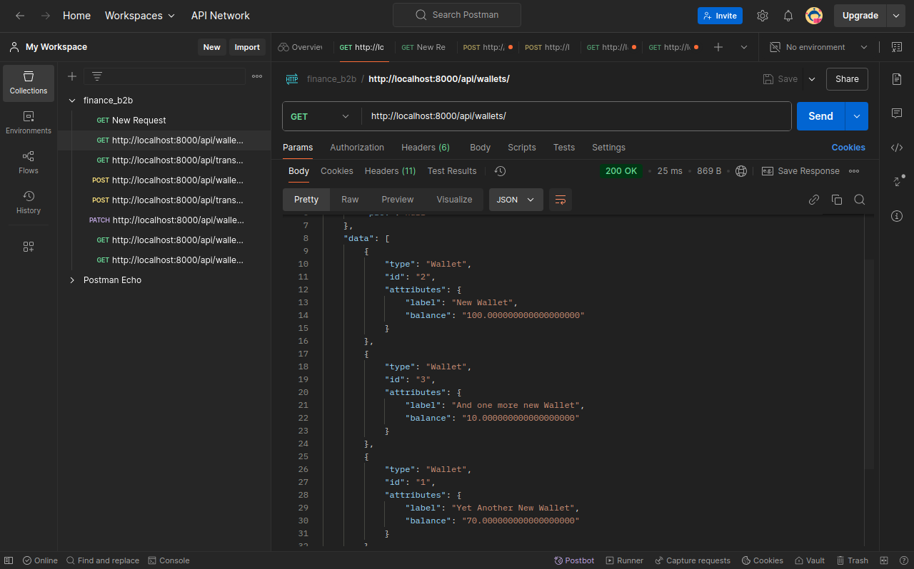
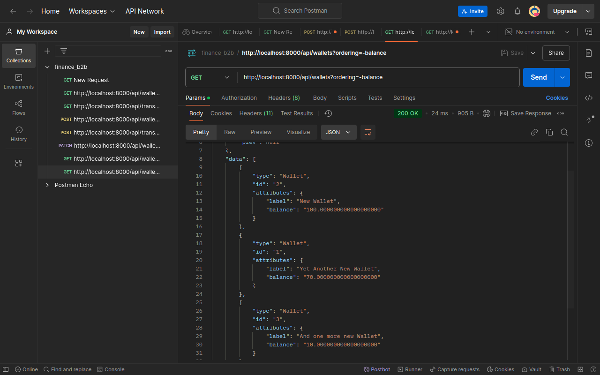
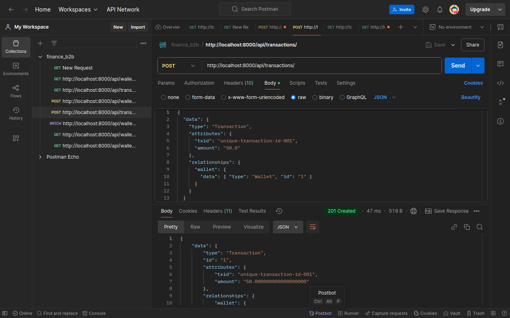

# Finance B2B

A Django REST API for managing wallets and transactions. 
This application uses PostgreSQL as its database, is containerized with Docker and Docker Compose, and follows the JSON:API specification. 
Whitenoise is used to serve static files. 

## Features

- **Wallet Management:** Create, update, and view wallets.
- **Transaction Processing:** Create transactions that update wallet balances.
- **REST API:** JSON:API–compliant endpoints with filtering, sorting, and pagination.
- **Admin Interface:** Django admin panel styled correctly via Whitenoise.
- **Dockerized:** Easily run the application using Docker and Docker Compose.
- **PostgreSQL:** Uses PostgreSQL as the production database.

## Prerequisites

- [Docker](https://docs.docker.com/engine/install/)
- [Docker Compose](https://docs.docker.com/compose/install/)
- Git

## Dependencies

- Django>=4.2
- djangorestframework
- djangorestframework-jsonapi
- django-filter
- gunicorn
- psycopg2-binary
- whitenoise

## Installation and Usage

1. **Clone the Repository:**

   ```bash
   git clone https://github.com/trueSnevar/finance_b2b.git
   cd finance_b2b
   
2. **Build and Start the Containers:**

    From the repository root, run:

   ```bash
   docker-compose up --build
   ```
    This command does the following:

    - Builds the Docker image: Uses the provided Dockerfile to build the Django application.
    - Starts the services: Launches two services—web (the Django application using Gunicorn) and db (the PostgreSQL database).


3. **Apply Database Migrations:**
    
    Once the containers are running, open a new terminal window and run:

   ```bash
   docker-compose exec web python manage.py migrate
   ```

4. **Collect Static Files:**

    Collect all static files (including admin assets) by running:

   ```bash
   docker-compose exec web python manage.py collectstatic --noinput
   ```
   
5. **Create a Superuser (Optional):**

    If you need to access the Django admin panel, create a superuser:
   
    ```bash
   docker-compose exec web python manage.py createsuperuser
   ```
    And follow the prompt instructions
    

6. **That's it! You can access the application now:**

    - API Endpoints: http://localhost:8000/api/
    - Admin Panel: http://localhost:8000/admin/


7. **Shutting Down the Containers:**

    To stop the running containers, press Ctrl+C in the terminal where docker-compose up is running, then execute:
    ```bash
   docker-compose down
   ```

# Examples using Postman

POST request to create a wallet


GET request to list existing wallets


GET request to list wallets sorted by balance in descending order


POST request to create a transaction
